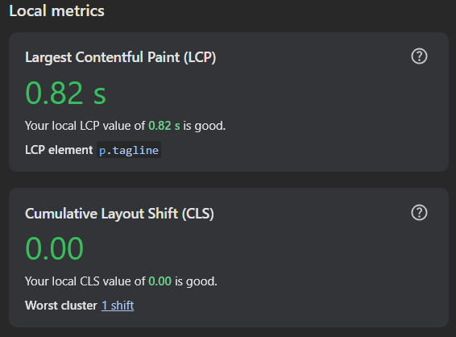
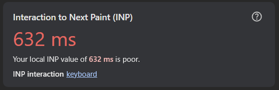
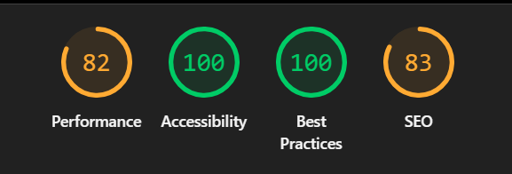
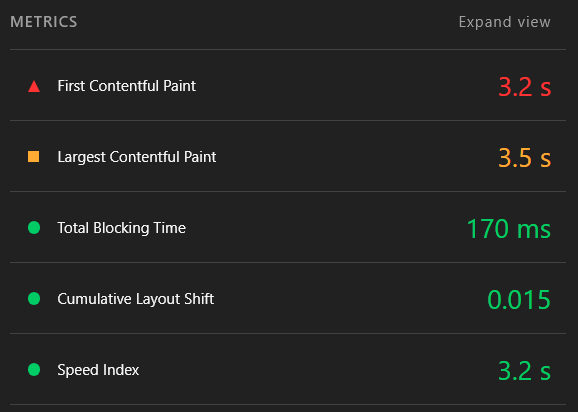
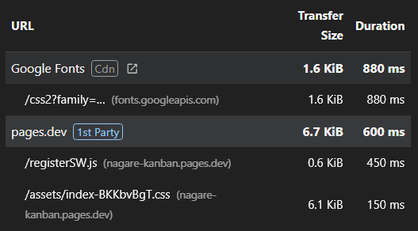
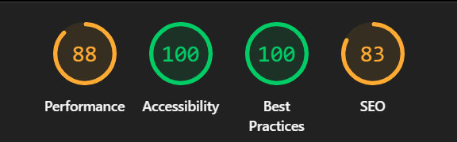
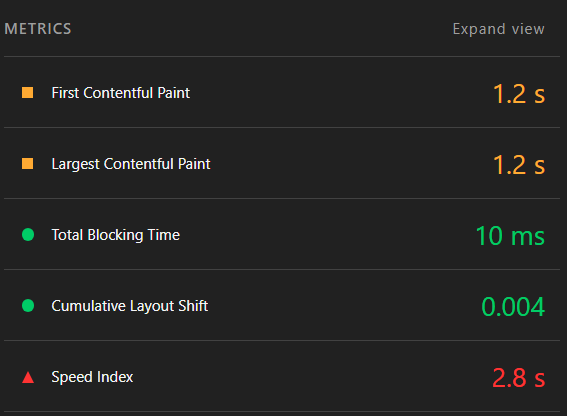
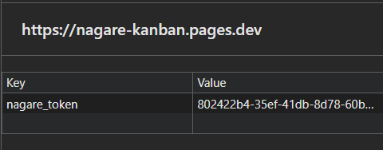
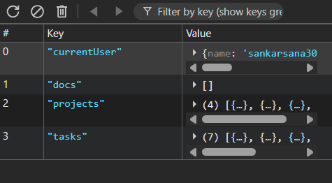

[Nagare, Japanese for 'flow' (流れ)](https://nagare-kanban.pages.dev/) is a full stack kanban board PWA I built in May 2026. 
It uses
- React for the frontend
- Redux for state management
- Hono for the backend
- Cloudflare D1 for the database

Page analysed - [Nagare Signup page](https://nagare-kanban.pages.dev/signup)

## Network
Initially, the browser loads the main HTML, CSS, fonts, logos and the service worker script.
[nagare-signup-network-log](image-1.png) 

The fonts are served from the disk cache, whereas the other assets are served from the service worker, with the icon being the exception (being transferred over the network). 
The assets being served from cache all load within 10ms, whereas those being served from service worker take much longer (around 40-50ms). However the icon being transferred over the network takes the longest to reach the browser (around 100ms).

## Performance
The local LCP and CLS for this page are in the green zone.

The INP for keyboard interaction is in the red zone. The causes for this will be analysed using Lighthouse.

## Lighthouse
The page has mostly decent performance scores on mobile.

The LCP and FCP values need to be improved since they are in the red and yellow zones respectively.

To speed up render, the following resources should be deferred.

`preconnect` can be added to the `<link>` tags of the Google Fonts endpoints to make the browser connect to that domain slightly before the first request is made.

The logo can be made responsive to reduce the download time, because then the browser downloads only the appropriate sized image (here, 100*100).

Non-critical JavaScript files should be loaded only when they are required, using lazy loading or dynamic imports.

Main thread work takes up about 3 seconds and this can be minimized by code splitting (smaller files to load), lazy loading (loading only when needed), reducing DOM complexity (faster layout calculation), using `transform` and `opacity` (faster due to GPU compositing) and removing unnecessary code (smaller bundle size).

The page has perfect scores for Accessibility and Best Practices, however the robots.txt file must be corrected to ensure better crawling (hence a higher SEO score).

The page had nearly identical Lighthouse scores on desktop as well.

Desktop LCP and FCP are significantly better due to desktop processors being more powerful than themobile processor simulated in Lighthouse.

## Application
Once the user has signed up or logged in, Nagare stores the auth token in localStorage.

Initially, Nagare was a local-first app, where I was storing all of the user's data in IndexedDB, but it was not practical for multiple device access, so I swapped it out for a deployed Cloudflare D1 database.

Nagare also includes a Web App Manifest, allowing it to be installed as a standalone PWA.